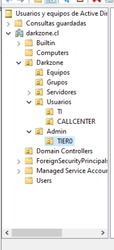
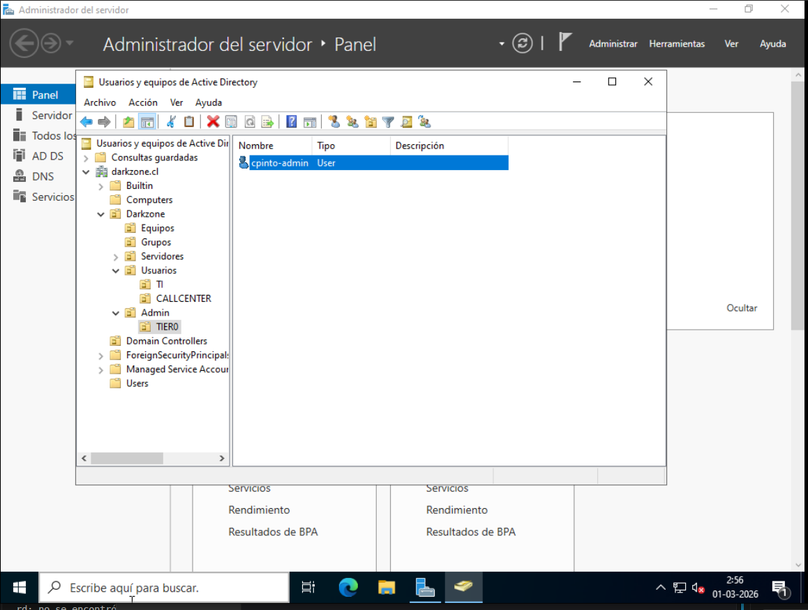
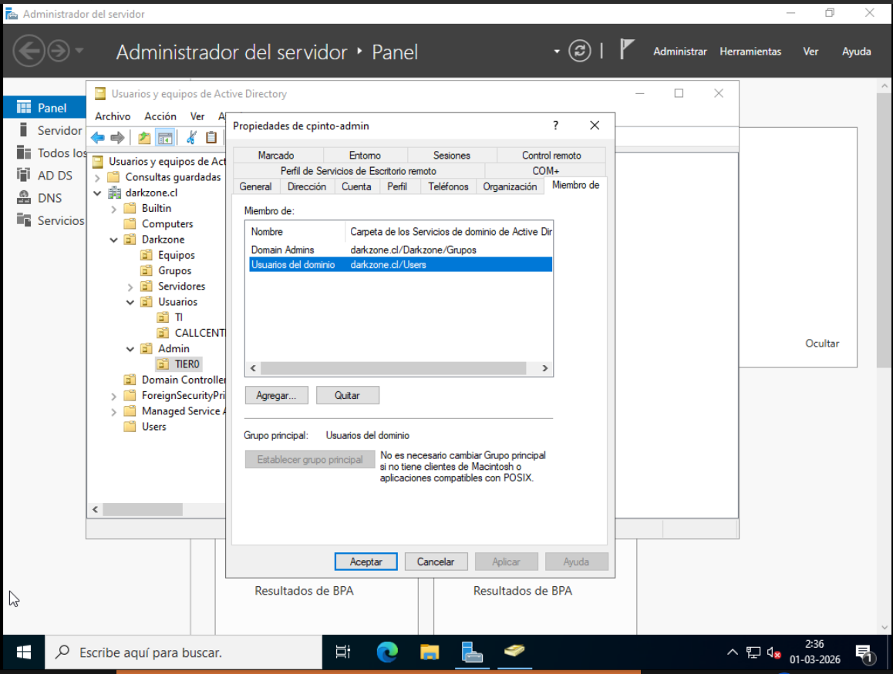
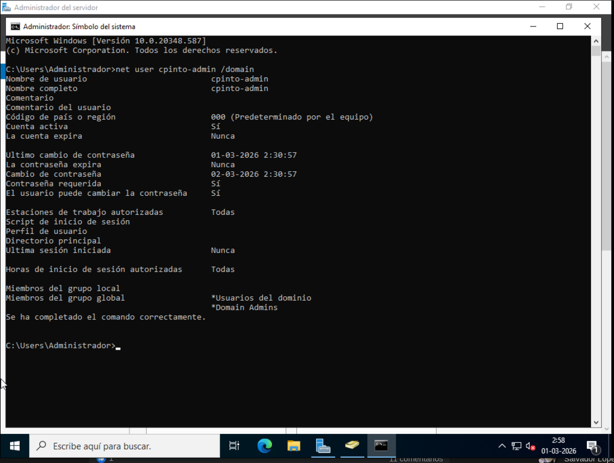

# 02 - Tier Model Implementation (Enterprise Approach)

## Overview

In this phase, a security-based administrative model was implemented following Microsoft’s Tiered Administration concept.

The objective is to separate administrative privileges based on security boundaries and reduce the attack surface within the Active Directory environment.

This implementation follows the Principle of Least Privilege and introduces dedicated administrative accounts.

---

## Tier Model Design

The environment is structured into logical security tiers:

### Tier 0 – Critical Identity Infrastructure
Includes:
- Domain Controllers
- Domain Admin accounts
- Enterprise Admin privileges
- Active Directory core services

Compromise at this level means full domain compromise.

### Tier 1 – Server Infrastructure
Includes:
- Application servers
- File servers
- Internal service servers

### Tier 2 – Workstations
Includes:
- User endpoints
- Standard employee devices

Each tier represents a security boundary.

---

## Organizational Unit Structure

The following OU structure was created:

darkzone.cl
└── Darkzone
├── Equipos
├── Servidores
├── Usuarios
│ ├── TI
│ └── CALLCENTER
├── Grupos
└── Admin
└── TIER0


📸 **Capture 1 – OU Structure**



---

## Administrative Account Separation

Two separate accounts were defined:

### Standard User Account
- Username: `cpinto`
- Used for daily tasks
- No domain-wide administrative privileges

### Tier 0 Administrative Account
- Username: `cpinto-admin`
- Located in: `Admin → TIER0`
- Member of:
  - Domain Admins
  - Domain Users (default membership)

📸 **Capture 2 – Tier0 Account Location**



📸 **Capture 3 – cpinto-admin Group Membership**



---

## Security Principles Applied

### 1. Least Privilege
Administrative privileges are only assigned when required.

### 2. Privileged Account Separation
Administrative accounts are not used for:
- Web browsing
- Email access
- Daily productivity tasks

### 3. Security Boundary Enforcement
Tier 0 accounts must only log on to Domain Controllers.
They must never log on to Tier 2 workstations.

---

## Verification

The administrative account was validated via command line:

```cmd
net user cpinto-admin /domain
```

📸 **Capture 4 – Command Verification**



Risk Mitigation Strategy

By separating administrative accounts and enforcing tier boundaries:

Credential theft risk is reduced.

Lateral movement attacks become harder.

Domain compromise probability is minimized.

Administrative auditing becomes clearer.

This approach aligns with enterprise security best practices.

Next Phase

Next steps will include:

Logon restriction policies for Tier 0 accounts

Privileged access control via GPO

Hardening of Domain Controllers

Delegation model implementation